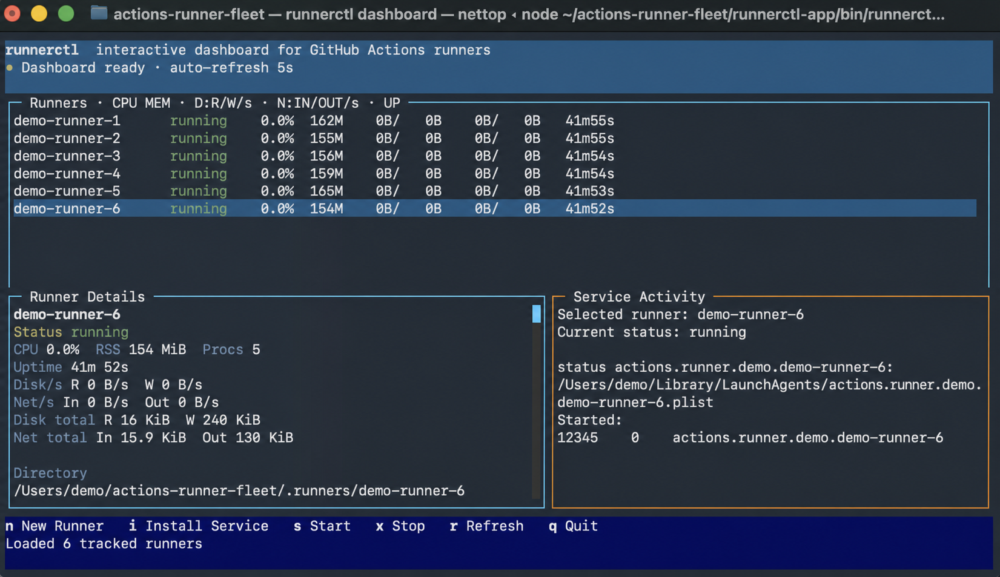
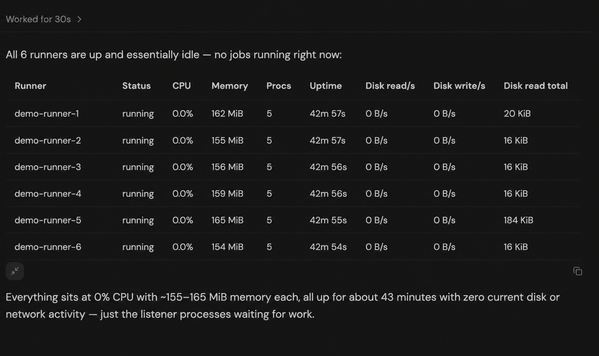

# Actions Runner Fleet

Set up and manage one or more GitHub Actions self-hosted runners on Ubuntu x64
or an Apple-silicon Mac. The kit supports repository-, organization-, and
enterprise-level runners, multiple GitHub targets, systemd user services on
Linux, launchd services on macOS, a terminal dashboard, and repeatable host
migration.

This repository is public, but it is designed to contain **no private
credentials**. Runner registration tokens, generated runner credentials,
workspaces, logs, caches, environment snapshots, keychains, and downloaded
tools are never committed.

## What gets installed

- GitHub Actions Runner `2.336.0` for Linux x64 or macOS arm64, verified by SHA-256
- One isolated directory and user service per runner (systemd or launchd);
  runner binaries are copy-on-write clones of a shared image where the
  filesystem supports it (XFS/Btrfs reflinks, APFS clonefiles)
- A persistent, dashboard-configurable CPU quota per runner (200% by default)
- Pinned Node.js `24.19.0` LTS, pnpm `11.20.0`, Wrangler, Pulumi, and AWS CLI
  tooling installed once per host under `host-tools/` and shared by every
  runner, along with a shared Actions tool cache, pnpm store, and npm cache;
  each runner keeps only symlinks, shims, and its own runtime state
- A terminal dashboard for status, registration, start, stop, and reconcile
- Log rotation and cleanup for runner and service diagnostics

Supported hosts are **Ubuntu/Linux x86_64** and **Apple-silicon macOS arm64**.
Windows, Linux ARM, and Intel Macs are not currently supported.

## Requirements

- Ubuntu/Linux using an `x86_64` shell, or Apple-silicon macOS using `arm64`
- On Linux, a working systemd user manager. Setup enables login lingering
  automatically so runners start at boot; if that is not permitted for the
  account, it warns and the fallback is `sudo loginctl enable-linger "$USER"`
- On macOS, an account that remains logged in while its launchd agents run
- Network access to GitHub, Node.js, the package registry, Pulumi, and AWS download endpoints
- Node.js and Corepack when building from this source checkout; setup installs pinned pnpm
- Admin access to each GitHub repository, organization, or enterprise that will
  own runners
- About 15 GiB of shared tooling and caches per host, a few GiB of workspace
  per runner, and at least 10 GiB of free headroom

Docker is optional on Linux but required for container actions and service
containers. Xcode, Swift, and CocoaPods are optional on macOS unless workflows
build Apple software. Install them before cutover when your jobs use
`xcodebuild`, `swiftc`, `codesign`, or `pod`. Xcode Command Line Tools are
required to build the pinned macOS CPU limiter during provisioning. The
dashboard also uses `clang` once to build a small local disk-I/O reader.

## Fastest setup: use the latest release

Open this repository's **Releases** page and download:

- `actions-runner-fleet-kit-macos-arm64-2.336.0.tar.gz`
- `actions-runner-fleet-kit-macos-arm64-2.336.0.tar.gz.sha256`

Authenticated GitHub CLI users can download the latest release instead:

```bash
GITHUB_REPOSITORY='YOUR_GITHUB_OWNER/actions-runner-fleet'
mkdir actions-runner-download
cd actions-runner-download
gh release download \
  --repo "$GITHUB_REPOSITORY" \
  --pattern 'actions-runner-fleet-kit-macos-arm64-*.tar.gz*'
shasum -a 256 -c actions-runner-fleet-kit-macos-arm64-2.336.0.tar.gz.sha256
tar -xzf actions-runner-fleet-kit-macos-arm64-2.336.0.tar.gz
mv actions-runner-fleet-kit-macos-arm64-2.336.0 ../actions-runner
cd ../actions-runner
```

Move or rename the extracted directory **before** registering runners. The
local registry records absolute runner-directory paths.

## Setup from the source repository

Clone the repository and prepare the checkout. The correct runner archive is
selected automatically for the current host:

```bash
GITHUB_REPOSITORY='YOUR_GITHUB_OWNER/actions-runner-fleet'
gh repo clone "$GITHUB_REPOSITORY" actions-runner
cd actions-runner
./prepare.sh
```

Replace `YOUR_GITHUB_OWNER` with the GitHub user or organization that owns the
private repository.

`prepare.sh` verifies the host, downloads the pinned official runner archive,
checks its SHA-256, installs the dashboard dependency, and creates an ignored
`fleet.tsv` from `fleet.example.tsv`.

## Choose the GitHub registration scope

Decide who should own and be allowed to use each runner **before** editing
`fleet.tsv` or generating a token. GitHub supports three registration scopes:

| Scope | Choose it when | Target URL |
| --- | --- | --- |
| Repository | Exactly one repository should use the runner | `https://github.com/OWNER/REPOSITORY` |
| Organization | Multiple repositories in one organization should share the runner | `https://github.com/ORGANIZATION` |
| Enterprise | Multiple organizations in GitHub Enterprise Cloud should share the runner | `https://github.com/enterprises/ENTERPRISE` |

These are GitHub's three supported ownership scopes. There is no separate
personal-account-wide runner scope; a runner for a personal repository is
repository-scoped.

Use the narrowest scope that covers the intended workflows. Organization scope
is usually the right choice for a fleet shared by several repositories in one
organization. Enterprise scope requires GitHub Enterprise Cloud and an
enterprise owner; after registration, runner-group access determines which
organizations and repositories can use the runner.

This kit therefore defaults to **organization scope**. In guided setup, press
Enter at the scope prompt to accept it. Choose repository or enterprise
explicitly when the runner should have narrower or broader ownership.

Do not guess this choice when preparing a fleet for someone else. Ask: **Should
this runner serve one repository, several repositories in one organization, or
repositories across several organizations?** The registration token must come
from the same scope as the target URL. Moving a runner to another scope later
requires registering it again with a token from the new scope.

GitHub recommends using self-hosted runners only with private repositories,
because workflows from forks of a public repository can run untrusted code on
the runner machine. See
[GitHub's self-hosted runner setup guide](https://docs.github.com/en/actions/how-tos/manage-runners/self-hosted-runners/add-runners).

## Configure your fleet

Edit `fleet.tsv`. It is tab-delimited with three columns:

This example shows all three scopes. Keep only the rows for targets you actually
intend to configure.

```text
token-key	GitHub target URL	runner name
MY_ORG	https://github.com/my-organization	mac-arm64-1
MY_ORG	https://github.com/my-organization	mac-arm64-2
MY_REPO	https://github.com/my-user/my-repository	repo-mac-1
MY_ENTERPRISE	https://github.com/enterprises/my-enterprise	enterprise-mac-1
```

Rules:

- Use real tab characters between columns.
- `token-key` must contain only uppercase letters, numbers, and underscores.
- Rows sharing a token key must use the same GitHub URL.
- Every runner name must be unique in the file.
- Runner names may contain letters, numbers, dots, underscores, and hyphens.
- Do not put a token, password, secret, or personal access token in this file.

Each token key becomes an optional environment-variable prefix. For example,
`MY_ORG` maps to `MY_ORG_RUNNER_REGISTRATION_TOKEN`.

The release contains a placeholder `fleet.tsv`; replace every `CHANGE_ME`
value before continuing.

New runners receive GitHub's default `self-hosted`, operating-system, and
architecture labels. To make a runner eligible only for workflows that request
a purpose-specific label, register it without those defaults:

```bash
RUNNER_REGISTRATION_TOKEN='short-lived-token' \
  ./bootstrap.sh \
    --url https://github.com/my-organization \
    --labels macos-build \
    --no-default-labels \
    macos-build-1
```

Those workflows must use `runs-on: macos-build`. Labels can only be set by the
configuration script during initial registration or replacement.

## Generate registration tokens

GitHub runner registration tokens expire after one hour. Generate one from the
same scope selected above immediately before setup:

- Repository runner: repository **Settings → Actions → Runners → New
  self-hosted runner**
- Organization runner: organization **Settings → Actions → Runners → New
  runner → New self-hosted runner**
- Enterprise runner: enterprise **Policies → Actions → Runners → New runner →
  New self-hosted runner**

Select Linux/x64 or macOS/ARM64 to match the host if GitHub asks for a platform.
This kit needs only the registration token from that page; do not paste the
displayed installation commands.

## Validate before changing GitHub

Run:

```bash
./restore-fleet.sh --check
./restore-fleet.sh --dry-run
```

The check verifies the supported host/architecture, bundled runner checksum, manifest, the
manager scripts, and disk headroom. The dry run prints every planned runner
directory without registering runners or installing services.

## Install a new fleet

For a fleet whose names do not already exist on GitHub:

```bash
./restore-fleet.sh
```

The script prompts without echoing for one registration token per token key,
registers every target group, provisions tools, installs systemd or launchd services, and
waits for every runner to report `Listening for Jobs`.

Prompted entry is recommended because the token is never written to disk or
shell history. For unattended setup, provide variables derived from the token
keys:

```bash
MY_ORG_RUNNER_REGISTRATION_TOKEN='short-lived-token' \
MY_REPO_RUNNER_REGISTRATION_TOKEN='short-lived-token' \
MY_ENTERPRISE_RUNNER_REGISTRATION_TOKEN='short-lived-token' \
  ./restore-fleet.sh
```

Do not save those variables in `.env`, `fleet.tsv`, shell profiles, or Git.

## Move existing runners to a new Mac

1. Prepare and dry-run the new Mac using the steps above.
2. Wait for all jobs on the old Mac to finish.
3. From the old runner-kit directory, stop every tracked runner:

   ```bash
   while IFS=$'\t' read -r name runner_dir; do
     ./manage-runners.sh stop "$name"
   done < runners.tsv
   ```

4. On the new Mac, reuse the same names with explicit replacement:

   ```bash
   ./restore-fleet.sh --replace-existing
   ```

5. Verify all runners and run a representative workflow before deleting the
   old runner directories.

`--replace-existing` invalidates the old registrations. A rollback therefore
requires fresh tokens to register the old directories again. Keep the old
directories until the new fleet is proven.

If you prefer not to replace registrations, delete the stopped runners in
GitHub settings first and run `./restore-fleet.sh` without the replacement
flag.

## Choose where runner directories live

By default, runner directories are created inside the kit directory under
`.runners/`. For example, runner `mac-arm64-1` is installed at
`actions-runner/.runners/mac-arm64-1`. The root `.gitignore` explicitly ignores
this directory and all runner machine state within it.

To choose another location, pass an explicit runner directory to
`manage-runners.sh register`. Existing automation can also set an absolute
prefix before the first fleet registration:

```bash
RUNNER_DIRECTORY_PREFIX='/Volumes/CI/actions-runner' ./restore-fleet.sh
```

That compatibility override creates paths such as
`/Volumes/CI/actions-runner-mac-arm64-1`.

Do not move the kit or runner directories after registration. If they must
move, stop and re-register them so launchd and `runners.tsv` contain the new
absolute paths.

## Verify and operate runners

List and inspect runners:

```bash
./runnerctl --cli list
./runnerctl --cli status mac-arm64-1
```

From the fleet-kit directory, open the interactive dashboard:

```bash
./runnerctl
```

The screenshots below use sanitized placeholder runner names, paths, service
identifiers, and process identifiers.



For a non-interactive snapshot that a model or script can request, use the
Markdown table or raw JSON output:

```bash
./runnerctl stats
./runnerctl stats --json
```



The table includes one row per runner and columns for CPU, resident memory,
process count, uptime, disk read/write rates and totals, and network
receive/send rates and totals. Active runners are sampled for about 11 seconds
so both disk and network rates have two observations. Set
`RUNNER_STATS_SAMPLE_MS=0` for an immediate snapshot when rate accuracy is not
needed.

The dashboard refreshes every five seconds and attributes resources to each
runner's launchd service plus its descendant process tree:

- The runner list shows CPU, resident memory, disk read/write rates, network
  receive/send rates, and service uptime for every tracked runner.
- The selected runner's detail pane shows process count, current I/O rates,
  cumulative observed disk bytes read/written, and network bytes
  received/sent.
- CPU can exceed 100% when a runner uses more than one core.
- Totals begin with counters from processes that are alive when the dashboard
  starts, then remain cumulative for that dashboard session. Very short-lived
  processes that start and exit entirely between refreshes cannot be counted.
- Network counters need about 5-10 seconds for the first `nettop` sample and
  dashboard refresh.

Set a different refresh interval in milliseconds, or disable automatic
refresh:

```bash
RUNNER_DASHBOARD_REFRESH_MS=2000 ./runnerctl
RUNNER_DASHBOARD_REFRESH_MS=0 ./runnerctl
```

Useful direct commands are:

```bash
./manage-runners.sh start mac-arm64-1
./manage-runners.sh stop mac-arm64-1
./manage-runners.sh status mac-arm64-1
./manage-runners.sh reconcile mac-arm64-1
./manage-runners.sh reconcile-all
```

### Configure runner CPU limits

Runners default to a `200%` CPU quota, which allows at most two logical CPUs per
runner. Linux applies the quota to the full systemd service cgroup. macOS uses
a pinned `cpulimit` build that monitors the listener and its descendants. In
both cases, a workflow and every process it launches share the same limit.

In the dashboard, select a runner and press `c` to view or change its limit.
The change is persisted in the runner directory for future starts. Linux
applies it live; macOS applies it at the next service restart so an in-progress
job is never interrupted. The equivalent command is:

```bash
./manage-runners.sh set-cpu-limit macos-build-1 200
```

CPU quota values are whole-number percentages (`100%` is one logical CPU,
`200%` is two). On macOS, the value cannot exceed the host's logical CPU count.
The macOS limiter follows the runner's process tree; a workflow that explicitly
detaches and reparents a process can escape that best-effort cap.

After setup, confirm each runner is idle/online in GitHub settings and run a
representative workflow for every GitHub target.

## Add a single runner without a fleet manifest

For guided setup, omit `--url`. The script defaults to organization scope, then
asks for the organization and its matching registration token. Select
repository or enterprise at the scope prompt to override the default:

```bash
./bootstrap.sh mac-arm64-3
```

For unattended setup, pass an explicit target URL and
`RUNNER_REGISTRATION_TOKEN`. Use `--replace-existing` only when deliberately
moving a same-name runner.

## Security model

The root `.gitignore` ignores everything by default and allowlists only source
files. In particular, Git never tracks:

- `.credentials`, `.credentials_rsaparams`, `.runner`, `.env`, or `.path`
- `.runners/`, including every default runner installation
- `runners.tsv` or the local `fleet.tsv`
- `_work`, `_diag`, downloaded tools, runner binaries, or archives
- Signing certificates, provisioning profiles, private keys, or packages

Before committing or publishing changes, run:

```bash
./security-audit.sh
git diff --cached --check
git status --short
```

The audit checks tracked paths and blobs for runner state, credential-bearing
file types, private keys, common GitHub/AWS/Slack/Stripe token formats, and the
current machine's home path. It reports filenames rather than printing
matching secret values.

GitHub Actions stores generated runner credentials inside each registered
runner directory. Those files are machine state, not portable configuration.
Always register fresh runners on the destination machine.

## Build a transfer archive

After `./prepare.sh` and after customizing `fleet.tsv`:

```bash
./build-portable-package.sh
```

For a generic distributable that contains the placeholder manifest:

```bash
RUNNER_FLEET_PATH='./fleet.example.tsv' \
  ./build-portable-package.sh
```

The builder:

1. Verifies the official runner archive checksum.
2. Includes only the manager, dashboard, overlay, README, sanitized demo
   images, and selected fleet manifest.
3. Creates an empty runtime `runners.tsv`.
4. Rejects live credentials, registrations, workspaces, logs, environment
   files, host-downloaded tools, and source-home paths.
5. Writes a `.tar.gz` and matching `.sha256` under `dist/`.

## Test

```bash
for test_script in tests/*.sh; do
  /bin/bash "$test_script"
done
pnpm --dir runnerctl-app test
./security-audit.sh
```

## Troubleshooting

- **Runner archive missing:** run `./prepare.sh`.
- **Manifest still contains `CHANGE_ME`:** edit `fleet.tsv`.
- **Registration token rejected:** generate a fresh token from the exact
  repository, organization, or enterprise scope identified by that row's URL.
- **Runner name already exists:** stop the old runner and deliberately use
  `--replace-existing`, or delete the old GitHub registration.
- **Service starts but runner stays offline:** inspect
  `<runner-directory>/_diag/Runner_*.log`.
- **Dashboard cannot find Node.js:** keep the bundled runner archive beside
  `runnerctl`; it extracts the runner's embedded Node executable when needed.
- **Dashboard disk I/O is unavailable:** install Xcode Command Line Tools with
  `xcode-select --install`, then restart `./runnerctl` so it can build the local
  `proc_pid_rusage` helper.
- **Dashboard network I/O says starting:** leave it open for at least five
  seconds so macOS `nettop` can emit its first process sample.
- **Insufficient disk:** clean old `_work` and tool caches or move the runner
  prefix to a larger volume before registration.
- **Apple build commands missing:** install/select full Xcode, accept its
  license, and install CocoaPods before running Apple build workflows.
