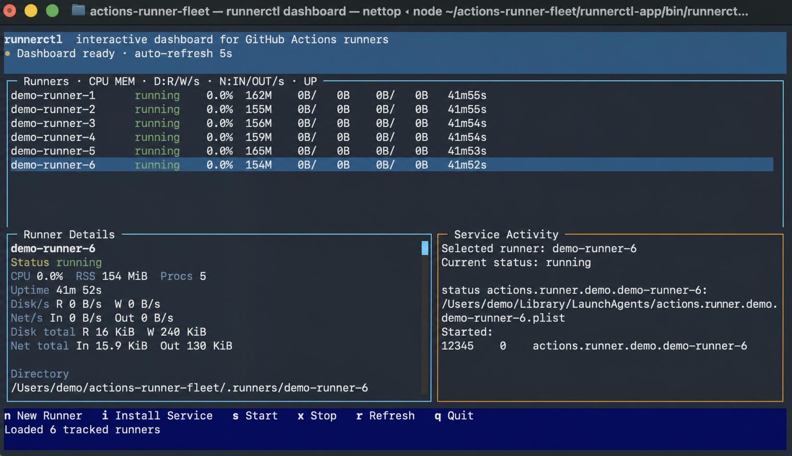
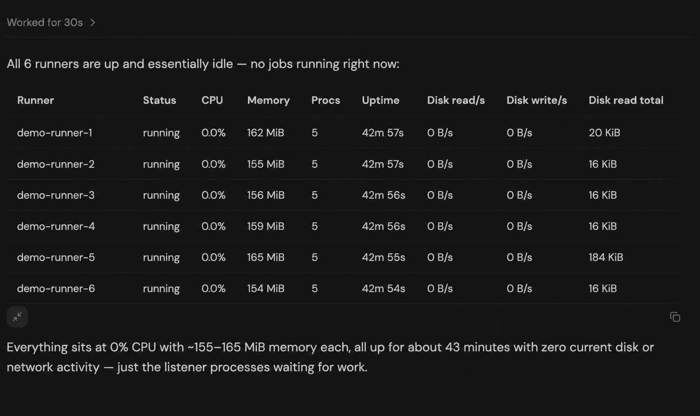

# Actions Runner Fleet

Set up and manage one or more GitHub Actions self-hosted runners on Ubuntu x64
or an Apple-silicon Mac. The kit supports repository-, organization-, and
enterprise-level runners, multiple GitHub targets, systemd user services on
Linux, launchd services on macOS, a terminal dashboard, and repeatable host
migration.

This repository is public, but it is designed to contain **no private
credentials**. Runner registration tokens, generated runner credentials,
workspaces, logs, caches, environment snapshots, keychains, and downloaded
tools are never committed.

Autoscaling is the default deployment path. After preparing the kit, edit the
ignored `autoscale.json` for your account and run `./runnerctl autoscale --prepare`.
Slot setup enables and starts the background controller automatically. It starts
at boot on Linux (with login lingering) or login on macOS. See
[automatic scaling](#automatic-runner-and-cpu-scaling) for configuration.

## What gets installed

- GitHub Actions Runner `2.336.0` for Linux x64 or macOS arm64, verified by SHA-256
- One isolated directory and user service per runner (systemd or launchd);
  runner binaries are copy-on-write clones of a shared image where the
  filesystem supports it (XFS/Btrfs reflinks, APFS clonefiles)
- A persistent, dashboard-configurable CPU quota per runner (50% of the
  host's available logical CPU capacity by default)
- Background CPU scheduling for Linux runners, allowing interactive services
  to take priority automatically when the host is under contention
- Pinned Node.js `24.19.0` LTS, pnpm `11.20.0`, Wrangler, Pulumi, and AWS CLI
  tooling installed once per host under `host-tools/` and shared by every
  runner, along with a shared Actions tool cache, pnpm store, and npm cache;
  each runner keeps only symlinks, shims, and its own runtime state
- A terminal dashboard for status, registration, start, stop, and reconcile
- Log rotation and cleanup for runner and service diagnostics

Supported hosts are **Ubuntu/Linux x86_64** and **Apple-silicon macOS arm64**.
Windows, Linux ARM, and Intel Macs are not currently supported.

## Requirements

- Ubuntu/Linux using an `x86_64` shell, or Apple-silicon macOS using `arm64`
- On Linux, a working systemd user manager. Setup enables login lingering
  automatically so runners start at boot; if that is not permitted for the
  account, it warns and the fallback is `sudo loginctl enable-linger "$USER"`
- On macOS, an account that remains logged in while its launchd agents run
- Network access to GitHub, Node.js, the package registry, Pulumi, and AWS download endpoints
- Node.js and Corepack when building from this source checkout; setup installs pinned pnpm
- Admin access to each GitHub repository, organization, or enterprise that will
  own runners
- About 15 GiB of shared tooling and caches per host, a few GiB of workspace
  per runner, and at least 10 GiB of free headroom

Docker is optional on Linux but required for container actions and service
containers. Xcode, Swift, and CocoaPods are optional on macOS unless workflows
build Apple software. Install them before cutover when your jobs use
`xcodebuild`, `swiftc`, `codesign`, or `pod`. Xcode Command Line Tools are
required to build the pinned macOS CPU limiter during provisioning. The
dashboard also uses `clang` once to build a small local disk-I/O reader.

## Fastest setup: use the latest release

Open this repository's **Releases** page and download:

- `actions-runner-fleet-kit-macos-arm64-2.336.0.tar.gz`
- `actions-runner-fleet-kit-macos-arm64-2.336.0.tar.gz.sha256`

Authenticated GitHub CLI users can download the latest release instead:

```bash
GITHUB_REPOSITORY='YOUR_GITHUB_OWNER/actions-runner-fleet'
mkdir actions-runner-download
cd actions-runner-download
gh release download \
  --repo "$GITHUB_REPOSITORY" \
  --pattern 'actions-runner-fleet-kit-macos-arm64-*.tar.gz*'
shasum -a 256 -c actions-runner-fleet-kit-macos-arm64-2.336.0.tar.gz.sha256
tar -xzf actions-runner-fleet-kit-macos-arm64-2.336.0.tar.gz
mv actions-runner-fleet-kit-macos-arm64-2.336.0 ../actions-runner
cd ../actions-runner
```

Move or rename the extracted directory **before** registering runners. The
local registry records absolute runner-directory paths.

## Setup from the source repository

Clone the repository and prepare the checkout. The correct runner archive is
selected automatically for the current host:

```bash
GITHUB_REPOSITORY='YOUR_GITHUB_OWNER/actions-runner-fleet'
gh repo clone "$GITHUB_REPOSITORY" actions-runner
cd actions-runner
./prepare.sh
```

Replace `YOUR_GITHUB_OWNER` with the GitHub user or organization that owns the
private repository.

`prepare.sh` verifies the host, downloads the pinned official runner archive,
checks its SHA-256, installs the dashboard dependency, and creates ignored
`fleet.tsv` and `autoscale.json` examples. Edit `autoscale.json` and run
`./runnerctl autoscale --prepare` to start the default autoscaled deployment.
The registration instructions below also support manually managed persistent fleets.

## Choose the GitHub registration scope

Decide who should own and be allowed to use each runner **before** editing
`fleet.tsv` or generating a token. GitHub supports three registration scopes:

| Scope | Choose it when | Target URL |
| --- | --- | --- |
| Repository | Exactly one repository should use the runner | `https://github.com/OWNER/REPOSITORY` |
| Organization | Multiple repositories in one organization should share the runner | `https://github.com/ORGANIZATION` |
| Enterprise | Multiple organizations in GitHub Enterprise Cloud should share the runner | `https://github.com/enterprises/ENTERPRISE` |

These are GitHub's three supported ownership scopes. There is no separate
personal-account-wide runner scope; a runner for a personal repository is
repository-scoped.

Use the narrowest scope that covers the intended workflows. Organization scope
is usually the right choice for a fleet shared by several repositories in one
organization. Enterprise scope requires GitHub Enterprise Cloud and an
enterprise owner; after registration, runner-group access determines which
organizations and repositories can use the runner.

This kit therefore defaults to **organization scope**. In guided setup, press
Enter at the scope prompt to accept it. Choose repository or enterprise
explicitly when the runner should have narrower or broader ownership.

Do not guess this choice when preparing a fleet for someone else. Ask: **Should
this runner serve one repository, several repositories in one organization, or
repositories across several organizations?** The registration token must come
from the same scope as the target URL. Moving a runner to another scope later
requires registering it again with a token from the new scope.

GitHub recommends using self-hosted runners only with private repositories,
because workflows from forks of a public repository can run untrusted code on
the runner machine. See
[GitHub's self-hosted runner setup guide](https://docs.github.com/en/actions/how-tos/manage-runners/self-hosted-runners/add-runners).

## Configure a manually managed persistent fleet

Edit `fleet.tsv`. It is tab-delimited with three columns:

This example shows all three scopes. Keep only the rows for targets you actually
intend to configure.

```text
token-key	GitHub target URL	runner name
MY_ORG	https://github.com/my-organization	mac-arm64-1
MY_ORG	https://github.com/my-organization	mac-arm64-2
MY_REPO	https://github.com/my-user/my-repository	repo-mac-1
MY_ENTERPRISE	https://github.com/enterprises/my-enterprise	enterprise-mac-1
```

Rules:

- Use real tab characters between columns.
- `token-key` must contain only uppercase letters, numbers, and underscores.
- Rows sharing a token key must use the same GitHub URL.
- Every runner name must be unique in the file.
- Runner names may contain letters, numbers, dots, underscores, and hyphens.
- Do not put a token, password, secret, or personal access token in this file.

Each token key becomes an optional environment-variable prefix. For example,
`MY_ORG` maps to `MY_ORG_RUNNER_REGISTRATION_TOKEN`.

The release contains a placeholder `fleet.tsv`; replace every `CHANGE_ME`
value before continuing.

New runners receive GitHub's default `self-hosted`, operating-system, and
architecture labels. To make a runner eligible only for workflows that request
a purpose-specific label, register it without those defaults:

```bash
RUNNER_REGISTRATION_TOKEN='short-lived-token' \
  ./bootstrap.sh \
    --url https://github.com/my-organization \
    --labels macos-build \
    --no-default-labels \
    macos-build-1
```

Those workflows must use `runs-on: macos-build`. Labels can only be set by the
configuration script during initial registration or replacement.

## Generate registration tokens

GitHub runner registration tokens expire after one hour. Generate one from the
same scope selected above immediately before setup:

- Repository runner: repository **Settings → Actions → Runners → New
  self-hosted runner**
- Organization runner: organization **Settings → Actions → Runners → New
  runner → New self-hosted runner**
- Enterprise runner: enterprise **Policies → Actions → Runners → New runner →
  New self-hosted runner**

Select Linux/x64 or macOS/ARM64 to match the host if GitHub asks for a platform.
This kit needs only the registration token from that page; do not paste the
displayed installation commands.

## Validate before changing GitHub

Run:

```bash
./restore-fleet.sh --check
./restore-fleet.sh --dry-run
```

The check verifies the supported host/architecture, bundled runner checksum, manifest, the
manager scripts, and disk headroom. The dry run prints every planned runner
directory without registering runners or installing services.

## Install a new fleet

For a fleet whose names do not already exist on GitHub:

```bash
./restore-fleet.sh
```

The script prompts without echoing for one registration token per token key,
registers every target group, provisions tools, installs systemd or launchd services, and
waits for every runner to report `Listening for Jobs`.

Prompted entry is recommended because the token is never written to disk or
shell history. For unattended setup, provide variables derived from the token
keys:

```bash
MY_ORG_RUNNER_REGISTRATION_TOKEN='short-lived-token' \
MY_REPO_RUNNER_REGISTRATION_TOKEN='short-lived-token' \
MY_ENTERPRISE_RUNNER_REGISTRATION_TOKEN='short-lived-token' \
  ./restore-fleet.sh
```

Do not save those variables in `.env`, `fleet.tsv`, shell profiles, or Git.

## Move existing runners to a new Mac

1. Prepare and dry-run the new Mac using the steps above.
2. Wait for all jobs on the old Mac to finish.
3. From the old runner-kit directory, stop every tracked runner:

   ```bash
   while IFS=$'\t' read -r name runner_dir; do
     ./manage-runners.sh stop "$name"
   done < runners.tsv
   ```

4. On the new Mac, reuse the same names with explicit replacement:

   ```bash
   ./restore-fleet.sh --replace-existing
   ```

5. Verify all runners and run a representative workflow before deleting the
   old runner directories.

`--replace-existing` invalidates the old registrations. A rollback therefore
requires fresh tokens to register the old directories again. Keep the old
directories until the new fleet is proven.

If you prefer not to replace registrations, delete the stopped runners in
GitHub settings first and run `./restore-fleet.sh` without the replacement
flag.

## Choose where runner directories live

By default, runner directories are created inside the kit directory under
`.runners/`. For example, runner `mac-arm64-1` is installed at
`actions-runner/.runners/mac-arm64-1`. The root `.gitignore` explicitly ignores
this directory and all runner machine state within it.

To choose another location, pass an explicit runner directory to
`manage-runners.sh register`. Existing automation can also set an absolute
prefix before the first fleet registration:

```bash
RUNNER_DIRECTORY_PREFIX='/Volumes/CI/actions-runner' ./restore-fleet.sh
```

That compatibility override creates paths such as
`/Volumes/CI/actions-runner-mac-arm64-1`.

Do not move the kit or runner directories after registration. If they must
move, stop and re-register them so launchd and `runners.tsv` contain the new
absolute paths.

## Verify and operate runners

List and inspect runners:

```bash
./runnerctl --cli list
./runnerctl --cli status mac-arm64-1
```

From the fleet-kit directory, open the interactive dashboard:

```bash
./runnerctl
```

The screenshots below use sanitized placeholder runner names, paths, service
identifiers, and process identifiers.



For a non-interactive snapshot that a model or script can request, use the
Markdown table or raw JSON output:

```bash
./runnerctl stats
./runnerctl stats --json
```



The table includes one row per runner and columns for CPU, resident memory,
process count, uptime, disk read/write rates and totals, and network
receive/send rates and totals. Active runners are sampled for about 11 seconds
so both disk and network rates have two observations. Set
`RUNNER_STATS_SAMPLE_MS=0` for an immediate snapshot when rate accuracy is not
needed.

The dashboard refreshes every five seconds and attributes resources to each
runner's launchd service plus its descendant process tree:

- The runner list shows CPU, resident memory, disk read/write rates, network
  receive/send rates, and service uptime for every tracked runner.
- The selected runner's detail pane shows process count, current I/O rates,
  cumulative observed disk bytes read/written, and network bytes
  received/sent.
- CPU can exceed 100% when a runner uses more than one core.
- Totals begin with counters from processes that are alive when the dashboard
  starts, then remain cumulative for that dashboard session. Very short-lived
  processes that start and exit entirely between refreshes cannot be counted.
- Network counters need about 5-10 seconds for the first `nettop` sample and
  dashboard refresh.

Set a different refresh interval in milliseconds, or disable automatic
refresh:

```bash
RUNNER_DASHBOARD_REFRESH_MS=2000 ./runnerctl
RUNNER_DASHBOARD_REFRESH_MS=0 ./runnerctl
```

Useful direct commands are:

```bash
./manage-runners.sh start mac-arm64-1
./manage-runners.sh stop mac-arm64-1
./manage-runners.sh status mac-arm64-1
./manage-runners.sh reconcile mac-arm64-1
./manage-runners.sh reconcile-all
```

### Disk-backed host temporary storage (Linux)

Before running builds, check the host's `/tmp` filesystem:

```bash
./configure-host-temp.sh --check
sudo ./configure-host-temp.sh --apply
```

Run `--apply` only when the check reports memory-backed storage. It masks
the vendor systemd `tmp.mount`, making `/tmp` use the underlying root disk
after the next reboot. It prints the root disk's available space; reserve
enough for build scratch and caches. A tmpfs size limit is not reserved RAM,
but files stored there compete with builds for RAM and swap.

The command leaves the active mount and running services intact. Schedule
the reboot after jobs and other host workloads can stop, and copy any needed
temporary files to persistent storage first: existing tmpfs contents disappear
on reboot. Afterwards, rerun `--check` to confirm the backing filesystem.
Repeated application is safe. Hosts with an explicit `/tmp` entry in
`/etc/fstab`, a symlinked `/tmp`, or a memory-backed root require separate
configuration; the command refuses to change them. It does not rewrite a
local administrator's `tmp.mount` unit.

### Automatic job temporary cleanup

Managed services set `TMPDIR`, `TMP`, and `TEMP` to the runner's
`tmp/managed-job` directory, keeping tools that honor these variables off
the host `/tmp` filesystem. Synchronous job hooks empty this directory before
and after each job, including hidden files and leftovers from interrupted
jobs. Existing job hooks run after the initial cleanup and before the final
cleanup. Cleanup refuses symlinked roots and does not cross filesystems.
Mounted or unremovable entries produce warnings instead of failing jobs.
Background processes must finish within their job; scratch files are removed
even if a job leaves a daemon running. To remove a previously chained custom
hook, clear its `RUNNER_PREVIOUS_JOB_STARTED_HOOK` or
`RUNNER_PREVIOUS_JOB_COMPLETED_HOOK` entry in the runner's `.env` and restart
the service. Hook paths and environment settings persist across runner upgrades.

Apply updates to existing runners with `./manage-runners.sh reconcile-all`,
which stops, updates, and starts each runner in turn. Run this when jobs are
idle because reconciliation restarts services.
The cleanup owns only `tmp/managed-job`; it does not remove old host `/tmp`
files, other runner temporary files, or shared caches. Tools that hard-code
`/tmp` use the host storage configured above. A single job can still exhaust storage
before it finishes; this prevents accumulation across jobs.

### Configure runner CPU limits

Runners default to 50% of the logical CPU capacity available to the host
process. CPU quotas use `100%` per logical CPU, so a host with eight available
logical CPUs has an `800%` ceiling and a `400%` default per runner. Linux
applies the quota to the full systemd service cgroup. macOS uses a pinned
`cpulimit` build that monitors the listener and its descendants. In both cases,
a workflow and every process it launches share the same limit.

Runner services are assigned to systemd's `background.slice`, whose lower CPU
weight lets services in `app.slice`—including an interactive T3 Code
service—take CPU time first when the host is busy. This is contention-aware:
runners can still use otherwise-idle CPU up to their configured quota.

In the dashboard, select a runner and press `c` to view or change its limit up
to the host's full available capacity. The change is persisted in the runner
directory for future starts. Linux applies it live; updated macOS wrappers reload the limiter within one
second without restarting the listener. The
equivalent command is:

```bash
./manage-runners.sh set-cpu-limit macos-build-1 200
```

CPU quota values are whole-number percentages (`100%` is one logical CPU,
`200%` is two) and cannot exceed the available logical CPU count multiplied by
100. The macOS limiter follows the runner's process tree; a workflow that
explicitly detaches and reparents a process can escape that best-effort cap.

After setup, confirm each runner is idle/online in GitHub settings and run a
representative workflow for every GitHub target.

## Add a single runner without a fleet manifest

For guided setup, omit `--url`. The script defaults to organization scope, then
asks for the organization and its matching registration token. Select
repository or enterprise at the scope prompt to override the default:

```bash
./bootstrap.sh mac-arm64-3
```

For unattended setup, pass an explicit target URL and
`RUNNER_REGISTRATION_TOKEN`. Use `--replace-existing` only when deliberately
moving a same-name runner.

## Automatic runner and CPU scaling

`runnerctl autoscale` manages a pool of **ephemeral runner slots** on Linux or
macOS. Each slot has its own provisioned directory and user service. The
controller obtains a fresh GitHub registration when capacity is needed. The
runner accepts one job, finishes it, deregisters itself, and exits. Its local
service then parks until the controller supplies another fresh registration.
Scaling down means withholding replacement registrations; **the controller
never stops or signals a listener to reduce capacity**.

After `./prepare.sh`, copy the public template into ignored local configuration:

```bash
test -f autoscale.json || cp autoscale.example.json autoscale.json
chmod 600 autoscale.json
```

Edit `target`, `repositories`, `labels`, and `runnerGroupId` to match
your account. Slot names are generated from hardware capacity by default;
you can supply a `runners` list to use specific **new runner names**. The controller refuses
existing persistent runners and never converts, deregisters, or stops them.
For a personal repository, use `"scope": "repository"` and
`"target": "YOUR_USER/YOUR_REPOSITORY"`. For an organization, use
`"scope": "organization"` and `"target": "YOUR_ORGANIZATION"`. The template
uses Linux x64 labels; change them to your workflow's labels on macOS.
`runnerGroupId` must be the numeric GitHub runner group ID for the target;
confirm it in your GitHub configuration rather than assuming the example ID.
Every slot in a pool uses the same labels and group.

For an existing machine, `baselineRunners` can list already registered
persistent runners in its local registry. Their active count and busy jobs
count toward the same total limits, and they share the CPU budget. They are
never started, stopped, converted, or deregistered by the controller. For
example, six baseline runners plus ten ephemeral slots provide a total range
of 6–16 without interrupting the existing fleet. The baseline count cannot
exceed `minRunners`; `runners` contains only the additional ephemeral slots.
New deployments use an empty baseline list.

Prepare the local slots and enable the background autoscaler:

```bash
./runnerctl autoscale --prepare
```

This clones the downloaded runner image, provisions shared tooling and local
job hooks, and installs each slot's user service. Once preparation completes, it enables
and starts the background controller, which registers listeners as needed.
Use `--prepare --no-enable` for preparation without activation. Existing matching slots are
left alone, so setup can resume after provisioning additional names. A failed
local provisioning step may require `./runnerctl --cli install-service NAME`
to complete installation. Run the controller as the user that owns these
services. Keep the kit and runner software up to date between generations;
automatic in-job runner updates are disabled for this pool.

Authenticate `gh` for `github.com`, or provide a token through the
`RUNNER_AUTOSCALE_TOKEN` environment variable using your secret manager.
Explicit `--dry-run` preview needs **Actions: read** on every selected repository and
**Self-hosted runners: read** for an organization pool, or **Administration:
read** for a repository pool. Default autoscaling needs **Self-hosted runners:
write** or **Administration: write**, respectively, to generate ephemeral
registrations. Organization approval/SSO policies still apply. Short-lived
registration tokens alone cannot monitor queues or create JIT configurations.

```bash
./runnerctl autoscale --prepare          # Prepare and enable background autoscaling (default)
./runnerctl autoscale --dry-run          # Preview one poll without changes
./runnerctl autoscale --dry-run --watch  # Continuously preview
./runnerctl autoscale                   # Apply continuously in the foreground
./runnerctl autoscale --once            # Apply one poll
./runnerctl autoscale --enable          # Enable/start background autoscaling
./runnerctl autoscale --disable         # Disable controller; current jobs finish
```

Use `--config /path/to/private-config.json` for configuration outside the
checkout. Setup installs a systemd user service on Linux or a launchd agent
on macOS. It uses that user's `gh` credential store; tokens are never copied
into the generated service definition. A token provided only in a foreground
shell is not inherited by the installed background service. Do not run a
second foreground controller while the background controller is enabled.
Keep tokens out of command lines, service unit files, and configuration files.
Only one preparing/applying controller can run per checkout. Do not manage
the same slots from multiple checkouts. Avoid manual service stops or
`reconcile-all` while jobs are running; those are administrative operations,
not part of the autoscaler's retirement path.

Only explicitly listed repositories are polled. No organization-wide
repository discovery occurs. Every selected repository must have access to
the configured runner group. Enterprise-scoped runners and GitHub Enterprise
Server are not supported by this controller yet.

The template derives capacity from the host. The maximum is the smaller of
one runner per two logical CPUs and one runner per 4 GiB of usable memory,
reserving the larger of 2 GiB or 20% of total RAM for the host. A minimum of
one runner is allowed on small machines. The warm minimum is one quarter of
that maximum (rounded down, at least one). These are sizing heuristics;
explicit numeric bounds remain available for workloads with different needs.
Existing baseline runners raise the effective minimum because they are never
stopped by the autoscaler. An explicit slot list caps automatic capacity at
the number of available slots. Omit `runners` to generate enough
`ci-ephemeral-N` slot names automatically during preparation.
Demand is busy pool members plus matching queued jobs, accounting for
already-idle listeners. The controller inspects jobs in active workflow runs,
including workflows with another job already running. All requested labels
must match the pool. Counts remain estimates: GitHub's jobs API does not
expose all runner-group and dependency eligibility information, and other
hosts can claim queued jobs first.

| Setting | Default | Meaning |
| --- | --- | --- |
| `minRunners` / `maxRunners` | `auto` / `auto` | Derived from CPU and RAM; numeric values override sizing |
| `intervalSeconds` | 60 | Delay between polls; minimum 15 seconds |
| `cooldownSeconds` | 120 | Delay between capacity increases; replacements up to granted capacity can start each poll |
| `lowLoad` / `highLoad` | 0.6 / 1.0 | One-minute load average divided by available logical CPUs |
| `minFreeMemoryPercent` | 10 | Block growth and reduce CPU budget below this available-memory level |
| `cpuBudgetPercent` | 80 | Normal pool CPU budget as a percentage of host CPU capacity |
| `pressureCpuBudgetPercent` | 30 | Pool CPU budget under host pressure |
| `minCpuQuotaPercent` / `maxCpuQuotaPercent` | 25 / 800 | Per-runner quota bounds; 100% means one logical CPU |

Under pressure, the controller divides the reduced CPU budget among active
listeners. It restores the normal budget and permits growth below the low
load threshold when memory is available. Between thresholds, it retains the
previous pressure state. The minimum count remains a floor under pressure.
A minimum per-runner quota can make the total exceed the pool budget; these
are policy targets, not an aggregate cgroup limit. On a 16-CPU host with 16
active listeners, the defaults allow each 80% of one CPU normally and 30%
under pressure.

Retirement happens at job completion, not on a timer. A runner already
listening for its first job remains available until it gets and finishes that
job, even if demand falls meanwhile. It is never killed based on an idle
snapshot. Parked services are small local supervisors with no job listener or
active GitHub registration. Minimum capacity is replenished at the next
successful poll, so a short gap after simultaneous completions is expected.

Linux CPU quotas cover service processes and their children; Docker
daemon-owned containers require their own resource limits. macOS uses the
kit's existing process CPU limiter, which is best effort. Load average includes
waiting work, and free-memory measurements are conservative. Tune thresholds
after observing your host. Polling costs grow with repositories and active
runs.

The controller reads local handoff, in-flight, and completion state to track
slot lifecycles. A missing or stale GitHub runner row never authorizes process
termination. Local host monitoring and CPU adjustments run before GitHub requests and continue
even when GitHub authentication or queue monitoring fails. API failures leave
runner counts alone; local
operation failures can leave earlier operations in that poll applied. Failed
listeners are parked as blocked and their consumed credentials are never
replayed, including after a supervisor restart. An ambiguous registration
request leaves a reservation requiring local recovery; definite HTTP
rejections permit a fresh attempt on a later poll. Inspect local `_diag` logs and lifecycle files,
confirm no job/listener remains, and resolve any orphan GitHub registration
before removing failed-generation state. Never remove an in-flight file or
worker lock while its process is alive.

Output contains aggregate counts and host load only. It omits account,
repository, runner, and job names, credentials, and raw error responses. JIT
credentials are validated for target, name, ephemeral mode, and allowed file
paths, then handed to the local service through owner-only files. Neither the
controller's token nor JIT credentials appear in listener arguments or the
service environment. `autoscale.json` and `.autoscale*` state are ignored by
Git and rejected by the security audit and package builder. The public package
contains only the example configuration and program source. Slots reuse
local tooling/workspaces; ephemeral registration does not make a new VM or
create a security boundary between jobs sharing an OS account.

Ctrl-C exits the controller while current jobs finish normally. It leaves
current quotas and parked services in place. The service restarts after controller failures. Kernel-owned locks release
automatically when their controller or worker exits. Interrupted generations
remain protected against credential replay.

API references: [workflow runs](https://docs.github.com/en/rest/actions/workflow-runs),
[workflow jobs](https://docs.github.com/en/rest/actions/workflow-jobs), and
[JIT runner configuration](https://docs.github.com/en/rest/actions/self-hosted-runners#create-configuration-for-a-just-in-time-runner-for-an-organization).

## Security model

The root `.gitignore` ignores everything by default and allowlists only source
files. In particular, Git never tracks:

- `.credentials`, `.credentials_rsaparams`, `.runner`, `.env`, or `.path`
- `.runners/`, including every default runner installation
- `runners.tsv`, the local `fleet.tsv`, `autoscale.json`, or `.autoscale*` lifecycle files
- `_work`, `_diag`, downloaded tools, runner binaries, or archives
- Signing certificates, provisioning profiles, private keys, or packages

Before committing or publishing changes, run:

```bash
./security-audit.sh
git diff --cached --check
git status --short
```

The audit checks tracked paths and blobs for runner state, credential-bearing
file types, private keys, common GitHub/AWS/Slack/Stripe token formats, and the
current machine's home path. It reports filenames rather than printing
matching secret values.

GitHub Actions stores generated runner credentials inside each registered
runner directory. Those files are machine state, not portable configuration.
Always register fresh runners on the destination machine.

## Build a transfer archive

After `./prepare.sh`, build a public distributable with placeholder configuration:

```bash
./build-portable-package.sh
```

For a private host migration, explicitly include your local fleet manifest.
This archive contains your target URLs and runner names; keep it private:

```bash
RUNNER_FLEET_PATH='./fleet.tsv' \
  ./build-portable-package.sh
```

The builder:

1. Verifies the official runner archive checksum.
2. Includes only the manager, dashboard, overlay, README, sanitized demo
   images, and selected fleet manifest.
3. Creates an empty runtime `runners.tsv`.
4. Rejects live credentials, registrations, workspaces, logs, environment
   files, host-downloaded tools, and source-home paths.
5. Writes a `.tar.gz` and matching `.sha256` under `dist/`.

## Test

```bash
for test_script in tests/*.sh; do
  /bin/bash "$test_script"
done
pnpm --dir runnerctl-app test
./security-audit.sh
```

## Troubleshooting

- **Runner archive missing:** run `./prepare.sh`.
- **Manifest still contains `CHANGE_ME`:** edit `fleet.tsv`.
- **Registration token rejected:** generate a fresh token from the exact
  repository, organization, or enterprise scope identified by that row's URL.
- **Runner name already exists:** stop the old runner and deliberately use
  `--replace-existing`, or delete the old GitHub registration.
- **Service starts but runner stays offline:** inspect
  `<runner-directory>/_diag/Runner_*.log`.
- **Dashboard cannot find Node.js:** keep the bundled runner archive beside
  `runnerctl`; it extracts the runner's embedded Node executable when needed.
- **Dashboard disk I/O is unavailable:** install Xcode Command Line Tools with
  `xcode-select --install`, then restart `./runnerctl` so it can build the local
  `proc_pid_rusage` helper.
- **Dashboard network I/O says starting:** leave it open for at least five
  seconds so macOS `nettop` can emit its first process sample.
- **Insufficient disk:** clean old `_work` and tool caches or move the runner
  prefix to a larger volume before registration.
- **Apple build commands missing:** install/select full Xcode, accept its
  license, and install CocoaPods before running Apple build workflows.

Autoscaling recovery and portability notes:

- Config changes are validated each poll. Invalid edits keep the last valid settings and produce an aggregate diagnostic. To provision additional slots, run `./runnerctl autoscale --disable`, edit the config, then `./runnerctl autoscale --prepare`. Disabling the controller does not stop runner services.
- One unavailable slot reserves capacity conservatively and receives no commands; healthy slots keep CPU control and can accept fresh registrations. HTTP registration rejections (400, 401, 403, 404, 422, 429) release their reservation for retry. Network failures, conflicts, and ambiguous server outcomes remain blocked for inspection.
- Current controllers and workers use kernel-owned loopback TCP locks, released automatically after a crash. Locks serve no protocol and contain no credentials. A deterministic port collision fails closed with a lock diagnostic. Legacy live PID locks are honored during upgrades. An interrupted generation remains blocked even after its lock is recovered; never replay its credentials.
- CPU quotas include idle listeners because any listener can accept work between polls. Dividing only by a stale busy count could exceed the host budget. Linux quota updates are batched for service-manager reloads. Available memory comes from Linux `MemAvailable` or macOS `memory_pressure -Q`; unavailable metrics conservatively block growth. macOS controller logs are bounded to approximately 1 MiB between polls.
- Use Node.js 24 or newer. The launcher prefers its bundled runtime and validates an explicit override. For a proxy, configure `HTTPS_PROXY`/`NO_PROXY` and `NODE_USE_ENV_PROXY=1` in the controller's private service environment (or foreground shell). These settings are not copied into the generated public service template; provisioning inherits only the explicit proxy/certificate variables, not GitHub tokens. Keep proxy credentials in an owner-only service environment file, outside Git.
- Public packages copy an explicit source allowlist and install dependencies in clean staging with `pnpm --frozen-lockfile --ignore-scripts`. Building requires pnpm and registry access or a populated package cache. Local dependency trees and unrelated files under source directories are excluded. New public source files must be added explicitly to `.gitignore` and, when shipped, the packaging allowlist.
- Supported targets are Linux x64 and Apple-silicon macOS, not arbitrary operating systems. macOS runtime changes require native validation on a Mac. Updating a worker script on disk takes effect when its parked supervisor is safely restarted; never restart a service that may own a job merely to deploy an update.

Final review recovery details:

- `--prepare` saves generated runner names into the private configuration before provisioning. Subsequent hardware changes adjust bounds while retaining every managed slot. To add capacity after a resize, disable the controller, add new slot names, and rerun preparation. Bare monitoring requires preparation first when no explicit slot list exists.
- A local start or handoff failure quarantines that slot for the controller process lifetime and allows later healthy slots to start. Repair the local service, inspect ambiguous lifecycle state, and restart only the controller to retry. Registration API failures retain their separate ambiguity rules.
- A reboot can interrupt even an idle ephemeral listener. Its registration may remain offline at GitHub and the local slot stays blocked. Inspect the slot's private diagnostics, confirm no listener/job remains, resolve the orphan registration, and only then remove failed-generation state before restarting that slot. Never reuse its consumed credentials.
- Runner service templates require kit, runner, and runtime paths without whitespace or shell/XML special characters. Use a simple path such as `/srv/runner-fleet` or `$HOME/runner-fleet`; unsupported paths are rejected before service provisioning. Controller-only paths are escaped independently.

macOS services target the logged-in user’s launchd GUI domain. A headless SSH session without a GUI login is not sufficient for starting these agents. Template updates require a safe service reload after its generation finishes; `kickstart` alone does not reload a changed plist.
